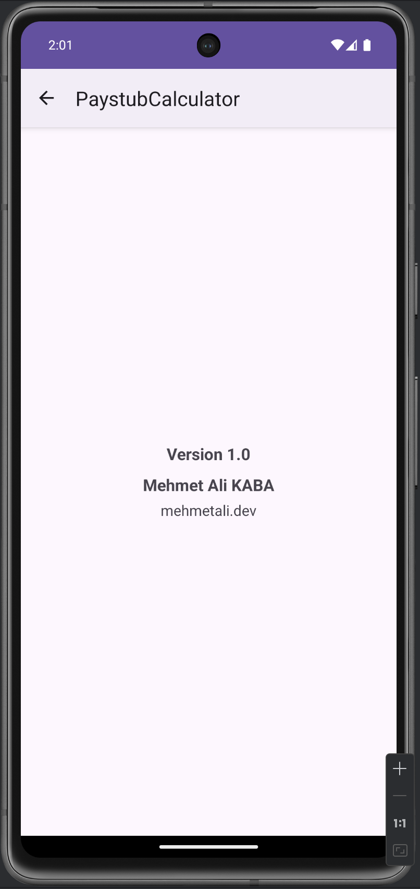

# Simple Paystub Calculator - Android App

## Overview
The Simple Paystub Calculator is an Android application designed to help businesses calculate paystubs for employees. The app allows users to enter employee details, compute regular and overtime wages, calculate taxes, and store the information in paystubs. Additionally, it provides functionality to view past calculations and manage employees.

This project includes multiple activities:
- **MainActivity**: This handles the paystub calculation, taking input for hours worked, overtime, and tax rate, then computes net pay.
- **EmployeesActivity**: Users can manage employee data, view previous paystubs, and add new employees.
- **HistoryActivity**: Displays past paystub history and allows users to delete paystubs.
- **AboutActivity**: Displays basic information about the application.

## Features
- **Paystub Calculation**: Allows input for hours worked, overtime, hourly rate, and tax rate to calculate net pay.
- **Employee Management**: Add, update, and delete employee data.
- **Paystub History**: View and manage previously calculated paystubs for each employee.
- **Data Persistence**: Uses `SharedPreferences` to save employee details and paystubs for future sessions.
- **Multi-Activity Navigation**: Users can navigate between different activities like employee management, calculation history, and the about page.

## App Structure

### MainActivity
- Inputs: Hours worked, overtime hours, hourly rate, overtime rate, and tax rate.
- Actions: 
    - **Calculate Pay**: Computes the net pay based on inputs.
    - **Add Paystub**: Adds the calculated paystub to the selected employee's history.
    - **Reset**: Resets the form inputs.

### EmployeesActivity
- Manage employee information (name, last name, role).
- View and manage paystubs for each employee.
- Add new employees to the system.
- Update or delete existing employee records.

### HistoryActivity
- Display the history of paystubs.
- Filter by date or employee.
- Ability to delete individual paystubs.

### AboutActivity
- Simple activity displaying basic information about the app.

## Installation
1. Clone the repository:
    ```bash
    git clone https://github.com/kabamehmetali/SimplePaystubCalculator-Android-.git
    ```
2. Open the project in Android Studio.
3. Build the project and run it on an emulator or a physical Android device.

## Technologies Used
- **Java**: For Android development.
- **Android SDK**: For building the application interface.
- **SharedPreferences**: For local data storage of employee and paystub details.
- **RecyclerView**: For listing paystubs and employee data.
- **Spinner**: For selecting employees in the UI.

## Screenshots


*MainActivity showing the paystub calculation form.*


*EmployeesActivity where users can add or update employee details.*


*HistoryActivity displaying past paystubs.*


*AboutActivity with information about the app.*


## Future Improvements
- Add the ability to export paystub data as a PDF.
- Implement cloud-based storage for employee and paystub data.
- Introduce more detailed pay calculations, including bonuses or deductions.

## License
This project is licensed under the terms of the MIT License. See the [LICENSE](LICENSE) file for details.

